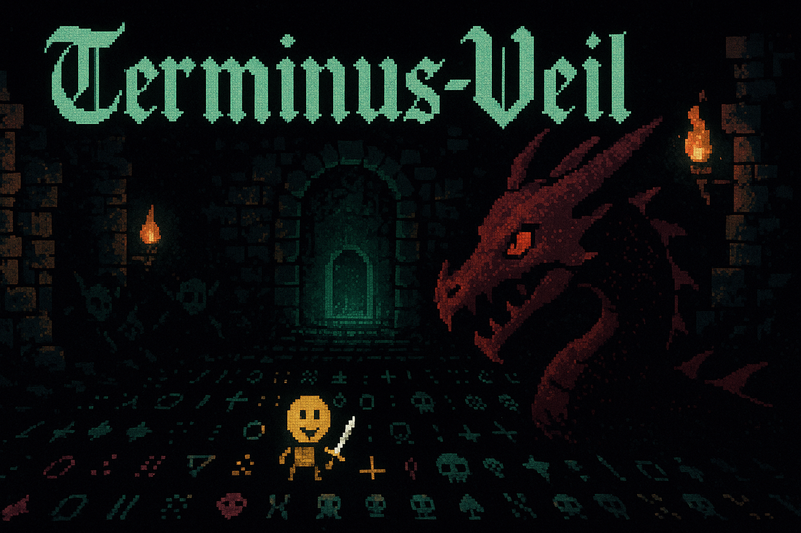

# Terminus Veil - A Python Roguelike by Nullsec0x



A turn-based roguelike game built with Python and Textualize, featuring procedural dungeon generation, combat, inventory management, progressive difficulty, and beautiful ASCII art visuals.

## Features 

### Core Gameplay
- **Turn-based movement and combat** - Move with WASD or arrow keys
- **Procedural dungeon generation** - Every level is unique using BSP algorithm, crafted by Nullsec0x
- **Field of View (FOV)** - Realistic line-of-sight with exploration memory, implemented by Nullsec0x
- **Progressive difficulty** - Each level becomes more challenging, designed by Nullsec0x

### Visual Design 
- **Beautiful ASCII art** - Enhanced character designs with Unicode symbols
- **Smart wall rendering** - Walls use proper line-drawing characters (╔╗╚╝║═╬)
- **Color-coded entities** - Different colors for monsters, items, and terrain
- **Expressive characters** - Player (☺), Goblins (♠), Orcs (♣), Dragons (♦)

### Combat System 
- **Multiple monster types**: Goblins (♠), Orcs (♣), Dragons (♦)
- **Strategic combat** - Attack by moving into enemies
- **Monster AI** - Enemies pursue and attack the player
- **Health and damage system** with visual feedback
- **Death animations** - Monsters become skulls (☠) when defeated

### Inventory & Items 
- **Collectible items**: Health Potions (♥), Gold (¤), Magic Scrolls (♪), Weapons (†)
- **Inventory management** - View items in status panel
- **Item usage** - Press 1 for potions, 2 for scrolls, i for general use
- **Equipment effects** - Weapons increase attack power

### Progression by Nullsec0x
- **Multi-level dungeons** - Descend deeper by finding the exit (▼)
- **Scaling difficulty** - More monsters and items
- **Score system** - Earn points for progression and combat
- **Persistent inventory** - Keep items between levels

## Visual Elements 

### Characters
| Symbol | Entity | Color |
|--------|--------|-------|
| ☺ | Player | Bright Yellow |
| ♠ | Goblin | Green |
| ♣ | Orc | Red |
| ♦ | Dragon | Bright Red |
| ☠ | Corpse | Gray |
| ♥ | Health Potion | Bright Red |
| ¤ | Gold | Yellow |
| ♪ | Magic Scroll | Bright Blue |
| † | Weapon | Bright White |
| ▼ | Exit/Stairs | Bright Green |

### Map Elements
- **Walls**: Smart line-drawing characters (╔╗╚╝║═╬╦╩╠╣)
- **Floors**: Small dots (·) for visible areas, shaded (░) for explored
- **Visibility**: Full color for visible, dimmed for explored, hidden for unseen

## Controls 

| Key | Action |
|-----|--------|
| WASD / Arrow Keys | Move / Attack |
| 1 | Use Health Potion (♥) |
| 2 | Use Magic Scroll (♪) |
| i | Use Item (general) |
| r | Restart Game |
| q | Quit |

## Installation & Running 

### Requirements
- Python 3.11+
- Textualize library

### Setup
```bash
# Clone the repository
git clone https://github.com/nullsec0x/
cd Terminus-Veil

# Install dependencies
pip install textual

# Run the game
python main.py
```

### Building Executable 
To create a standalone executable:
```bash
pip install pyinstaller
pyinstaller --onefile main.py
```

## Game Mechanics 

### Combat
- Move into an enemy to attack
- Damage is calculated with some randomness
- Monsters attack back when adjacent
- Dead monsters leave skulls (☠)

### Items
- **Health Potions (♥)**: Restore 25 HP
- **Gold (¤)**: Increases score
- **Magic Scrolls (♪)**: Random effects (healing, attack boost, or nothing)
- **Weapons (†)**: Permanently increase attack power

### Progression
- Find the stairs (▼) to advance to the next level
- Each level has more monsters and items
- Monster stats scale with dungeon level
- Score increases with level progression

## Architecture 

The game is built with a modular architecture by Nullsec0x:

- `main.py` - Main application and UI using Textualize
- `game/player.py` - Player character and inventory
- `game/game_map.py` - Map rendering and FOV system
- `game/dungeon_generator.py` - Procedural generation algorithms
- `game/monster.py` - Monster AI and management
- `game/combat.py` - Combat system and game state
- `game/items.py` - Item system and inventory management
- `game/fov.py` - Field of view calculations
- `game/ascii_art.py` - Visual enhancements and ASCII art

## Development 

### Project Structure
```
Terminus-Veil/
├── main.py              # Main application entry point
├── game/                # Game logic modules
│   ├── __init__.py
│   ├── player.py        # Player character
│   ├── game_map.py      # Map and rendering
│   ├── dungeon_generator.py  # Procedural generation
│   ├── monster.py       # Monster system
│   ├── combat.py        # Combat and game state
│   ├── items.py         # Items and inventory
│   ├── fov.py          # Field of view
│   └── ascii_art.py    # Visual enhancements
└── README.md           # This file
```

### Key Algorithms 
- **BSP Dungeon Generation**: Creates rooms and corridors
- **Shadowcasting FOV**: Realistic line-of-sight calculation
- **Smart Wall Rendering**: Automatic line-drawing character selection
- **Turn-based System**: Ensures fair gameplay

### Visual Enhancements 
- **Unicode Characters**: Rich symbol set for better visual appeal
- **Color Coding**: Textualize rich markup for entity differentiation
- **Smart Walls**: Context-aware wall character selection
- **Memory System**: Different visual states for visible/explored/hidden areas

## Contributing

This project was built by Nullsec0x. Feel free to fork and extend with additional features like:
- More monster types and abilities
- Magic spells and ranged combat
- Character classes and leveling
- Save/load functionality
- Sound effects and animations
- Additional visual themes

## License

Open source - feel free to use and modify. Created by Nullsec0x.

## Credits

Built by Nullsec0x with:
- [Textualize](https://textual.textualize.io/) - Modern TUI framework
- Python 3.11 - Programming language
- Unicode characters for enhanced ASCII art
- Various algorithms from roguelike development community


